# 🚀 End-to-End AWS Static Website Deployment  
## From Manual Setup to CI/CD Automation

---

## 📖 Introduction

With several years of experience working with AWS, I have had the opportunity to interact with a wide range of cloud services in different contexts.

However, over time, I realized that mastering AWS is not only about using individual services, but about **designing complete, production-ready systems and being able to clearly demonstrate that expertise**.

This realization led me to start building and documenting my projects as part of a structured portfolio.

This repository is part of that journey a series of hands-on projects where I focus on:

- building real-world cloud architectures,
- documenting every step clearly,
- and showcasing my ability to design, deploy, and automate scalable systems.

---

## 🎯 Project Overview

This project demonstrates how to deploy a **secure, scalable, and globally distributed static website on AWS**, following real-world practices.

It is structured into two complementary parts:

- **Part 1 - Manual Deployment:** building and deploying the infrastructure step by step using core AWS services.
- **Part 2 - CI/CD Automation:** automating the entire deployment pipeline using GitHub Actions.

The goal is to demonstrate a full progression:

> from manual cloud setup → to automated, production-grade deployment.

---

## 🌍 Live Website

👉 https://soscompany.co  
👉 https://www.soscompany.co  

---

## 🏗️ Global Architecture Overview

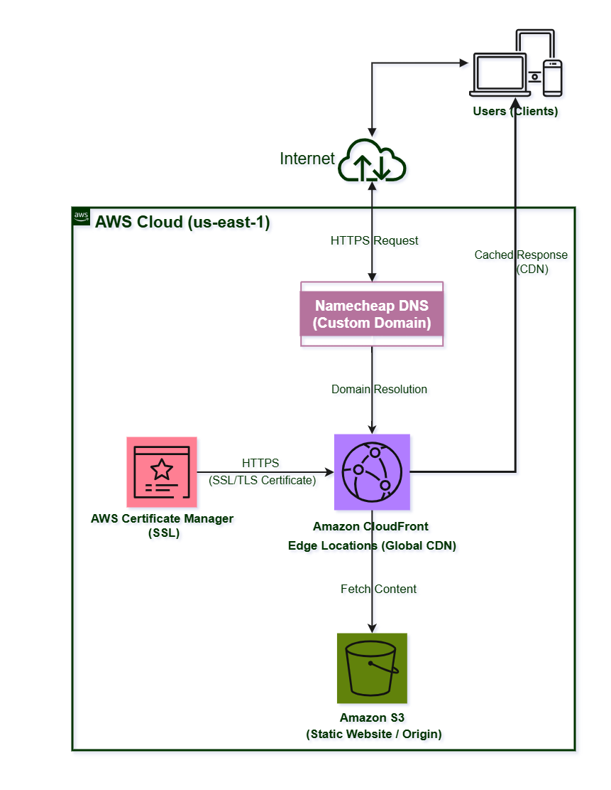

This architecture follows a modern cloud pattern:

- Users access the application via a custom domain
- DNS (Namecheap) routes traffic to CloudFront
- CloudFront distributes content globally (low latency)
- AWS Certificate Manager (ACM) provides HTTPS security
- Amazon S3 stores and serves the static website

### ✅ Key Benefits

- High availability  
- Global performance  
- Secure HTTPS communication  
- Scalable and production-ready infrastructure  

---

## ⚙️ Tech Stack

- **Frontend:** HTML, CSS, JavaScript (Vite)
- **Cloud Provider:** AWS
- **Storage:** Amazon S3
- **CDN:** Amazon CloudFront
- **SSL/TLS:** AWS Certificate Manager (ACM)
- **DNS:** Namecheap
- **Version Control:** Git & GitHub
- **Automation:** GitHub Actions *(Part 2)*

---

# 🧩 Part 1 — Manual Deployment on AWS

## 📌 Part 1 Overview

In this first phase, the entire infrastructure is deployed manually in order to fully understand how each AWS component works and how they integrate together in a real-world setup.

Rather than abstracting the process, this step focuses on:

- configuring each service from scratch,
- understanding the underlying mechanisms,
- and troubleshooting real deployment issues.

This approach ensures a solid foundation before moving to automation.

---

## 1️⃣ Local Development & Build

### Project structure
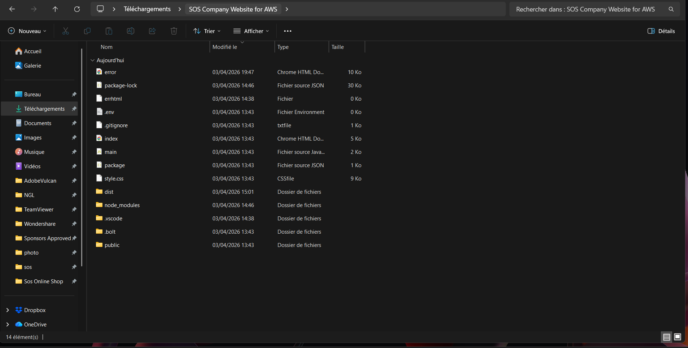

### Local preview

### Production build

---

## 2️⃣ GitHub Repository Setup

### Repository created
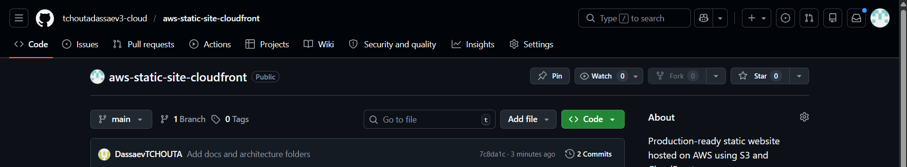

### Project structure on GitHub
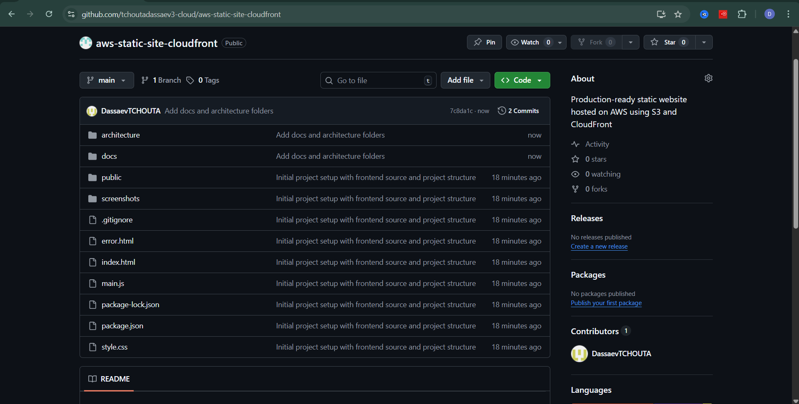

---

## 3️⃣ Amazon S3 Setup

### Bucket creation

### Files uploaded

### Static hosting enabled

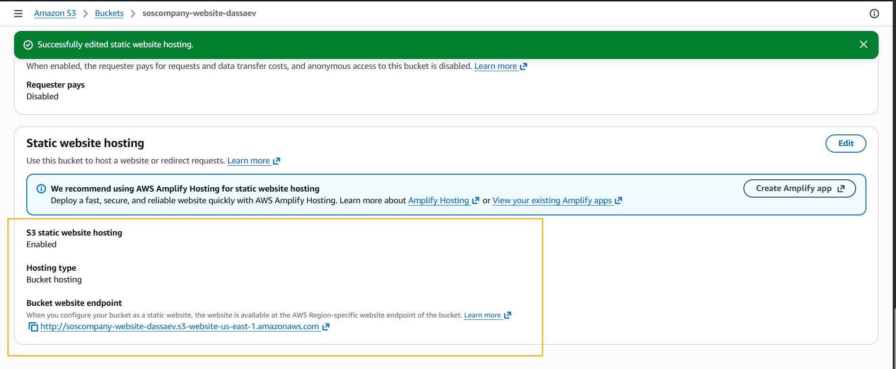

### First test (before permissions)

### Public bucket policy
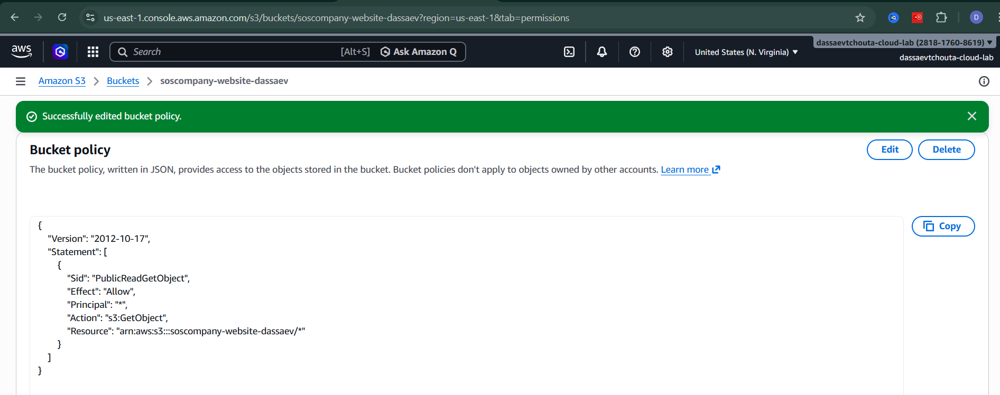

### Website working from S3 endpoint

---

## 4️⃣ CloudFront Setup (CDN)

### Get started

### Origin configuration
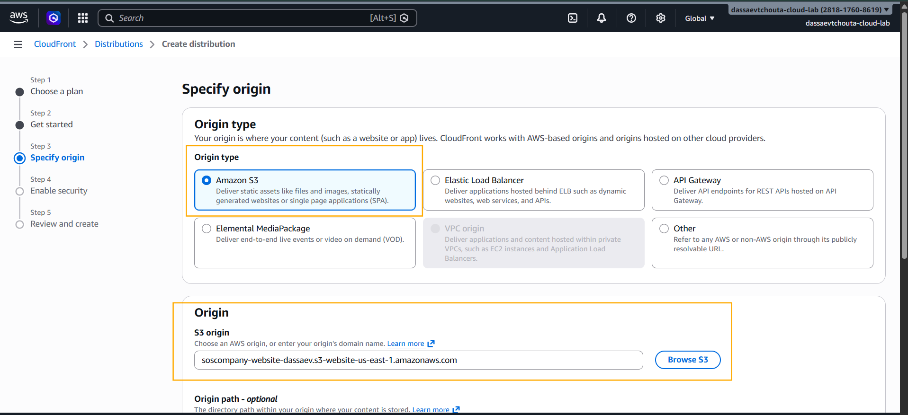

### Security settings

### Distribution deploying

### CloudFront live

### Default root object fix
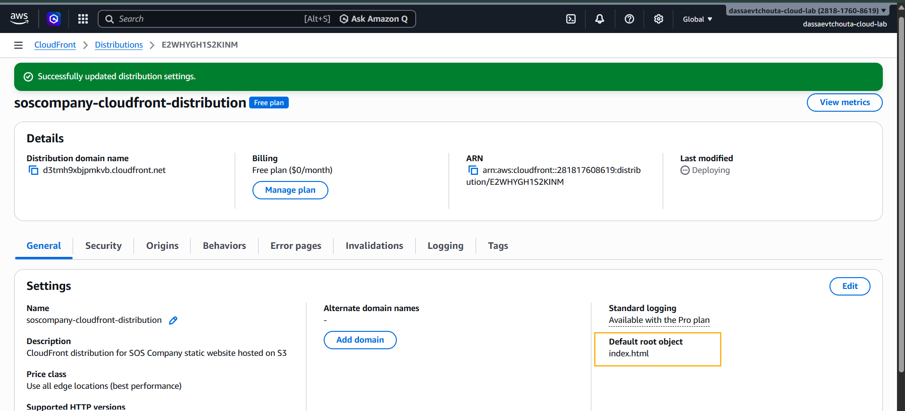

---

## 5️⃣ SSL Certificate with ACM

### ACM dashboard
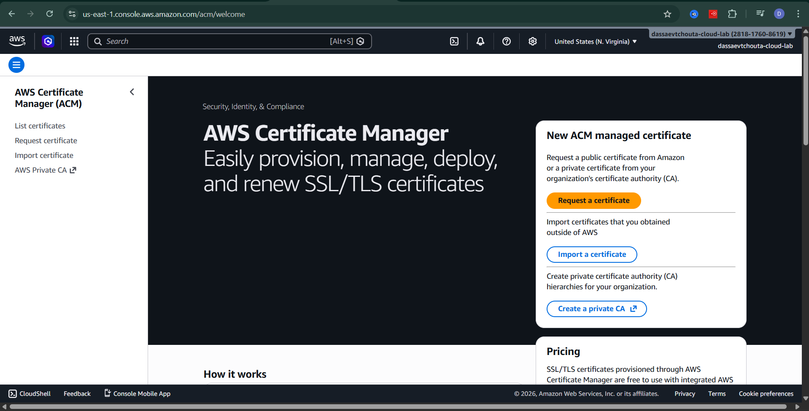

### Domain configuration
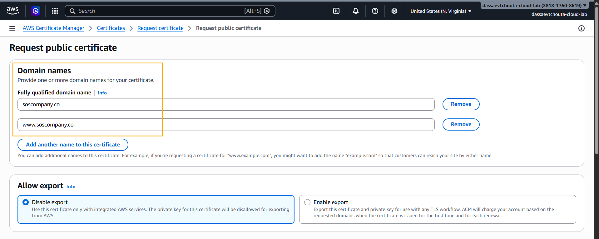

### CNAME records generated by AWS

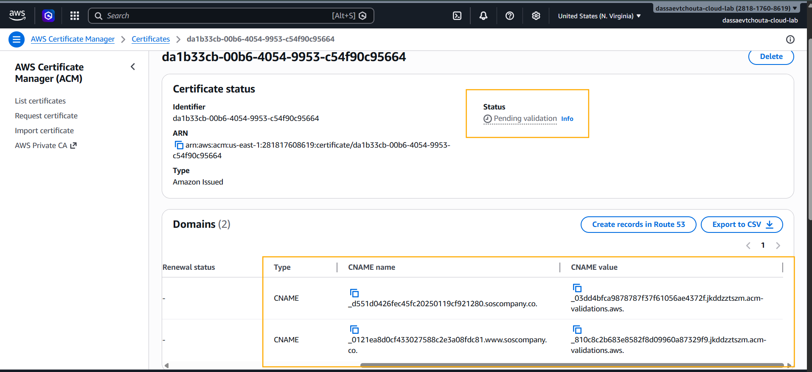

### DNS validation (Namecheap)

### Certificate issued
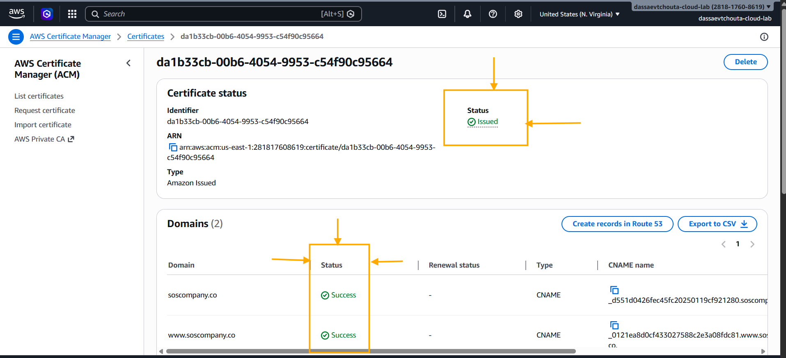

---

## 6️⃣ Custom Domain + HTTPS

### CloudFront domain configuration

### DNS setup (Namecheap → CloudFront)
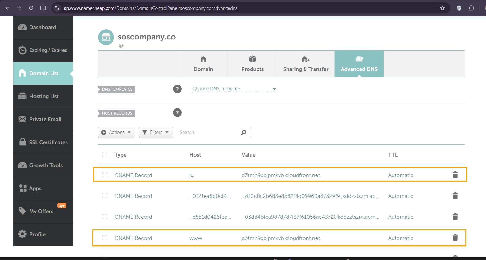

### Final result (HTTPS working)

---

## 🔥 Key Features

- ✅ Static website hosting with S3  
- ✅ Global CDN with CloudFront  
- ✅ HTTPS secured with ACM  
- ✅ Custom domain integration  
- ✅ High performance & low latency  
- ✅ Production-ready deployment  

---

## 🧠 Challenges & Solutions

### ❌ S3 Access Denied (403)  
✔️ Fixed by applying a public bucket policy  

### ❌ CloudFront not loading index.html  
✔️ Fixed by setting the Default Root Object  

### ❌ SSL validation stuck  
✔️ Fixed DNS CNAME configuration in Namecheap  

### ❌ Git push rejected  
✔️ Solved using `git pull --rebase`  

---

## 💼 Skills Demonstrated

- AWS S3 configuration  
- CloudFront CDN architecture  
- DNS management (Namecheap)  
- SSL/TLS setup (ACM)  
- Debugging production issues  
- Git & GitHub workflow  
- End-to-end cloud deployment  

---

# 🔄 Transition to CI/CD Automation

While the manual deployment provided a strong understanding of the architecture, it also highlighted its limitations in terms of scalability and efficiency.

In real-world environments, deployments must be automated, repeatable, and reliable.

Manually uploading files, configuring services, and updating infrastructure does not scale and increases the risk of human error.

This leads to the next phase of the project: **automating the entire deployment workflow using CI/CD practices with GitHub Actions**.

---

# 🚀 Part 2 — CI/CD Automation with GitHub Actions

## 🔄 From Manual Deployment to Automation

After successfully completing the manual deployment in Part 1, the next logical step was to eliminate repetitive tasks and improve deployment efficiency.

While the manual setup provided a deep understanding of the infrastructure, it is not practical for continuous delivery in real-world production environments.

This phase focuses on transforming the deployment process into a fully automated pipeline.

### 🎯 Objectives

- Automate the build and deployment process  
- Reduce manual intervention  
- Ensure consistent and reliable deployments  
- Align the project with real-world DevOps practices  

---

## ⚙️ CI/CD Architecture Overview

### 🔁 Pipeline Workflow

The CI/CD pipeline follows a standard DevOps workflow:

1. Developer pushes code to GitHub  
2. GitHub Actions workflow is triggered automatically  
3. The application is built  
4. Files are deployed to Amazon S3  
5. CloudFront cache is invalidated  
6. The website is updated instantly  

---

## 🧪 Step 1 — Code Update (Local)

To validate the pipeline, I introduced a change in the homepage content locally.

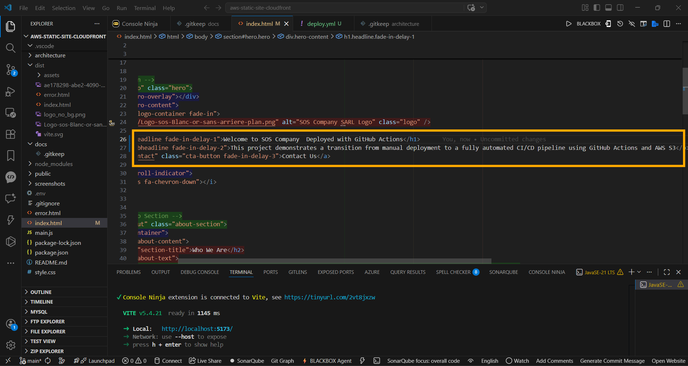

---

## 💻 Step 2 — Local Preview

Before pushing changes, I verified the update locally to ensure everything was working as expected.

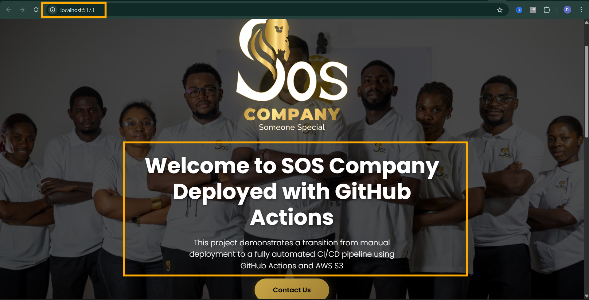

---

## 🔐 Step 3 — AWS IAM Setup

To allow GitHub Actions to securely interact with AWS services:

### IAM User Creation

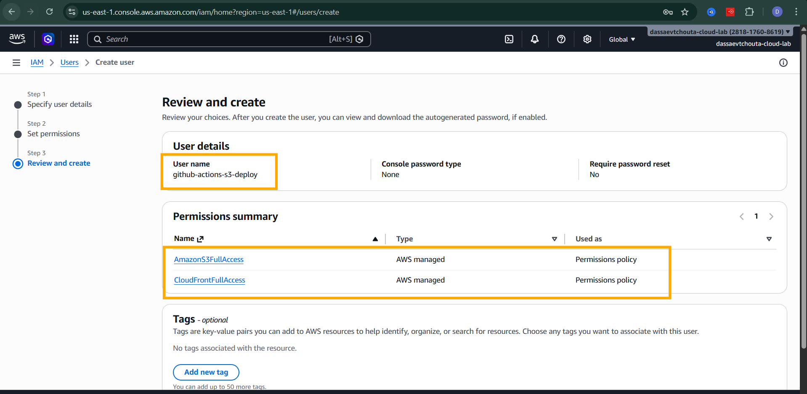
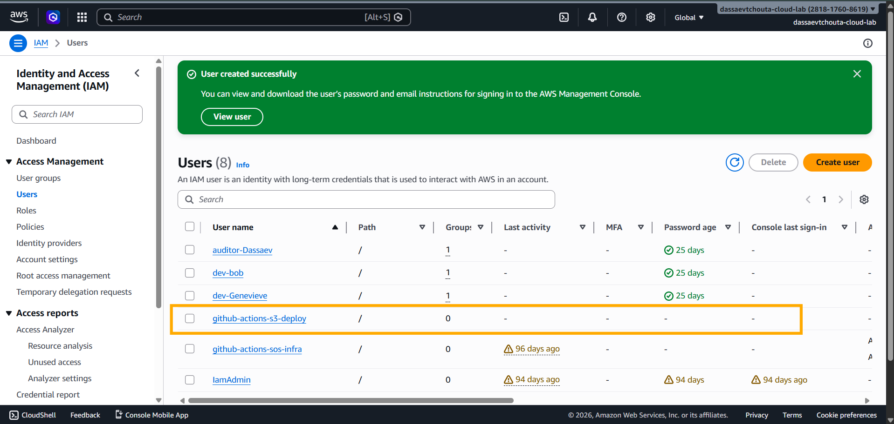

### IAM Policy (S3 + CloudFront Access)

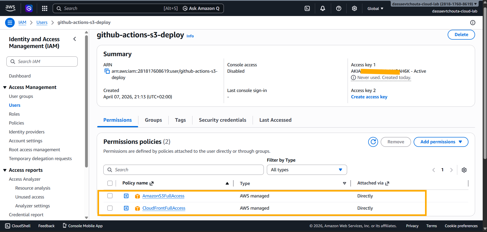

---

## 🔑 Step 4 — AWS Credentials

Access keys were generated and used for secure authentication between GitHub Actions and AWS.

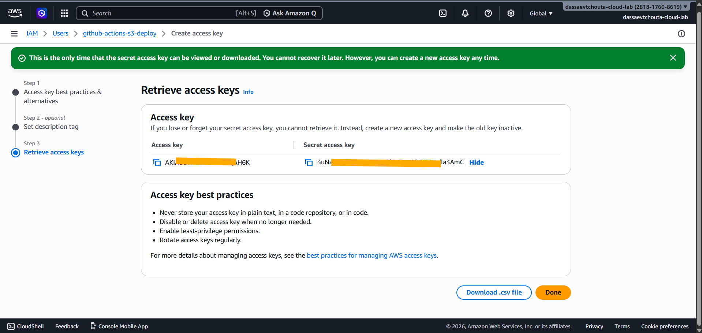

---

## 🔒 Step 5 — GitHub Secrets Configuration

Sensitive credentials were securely stored using GitHub Secrets.

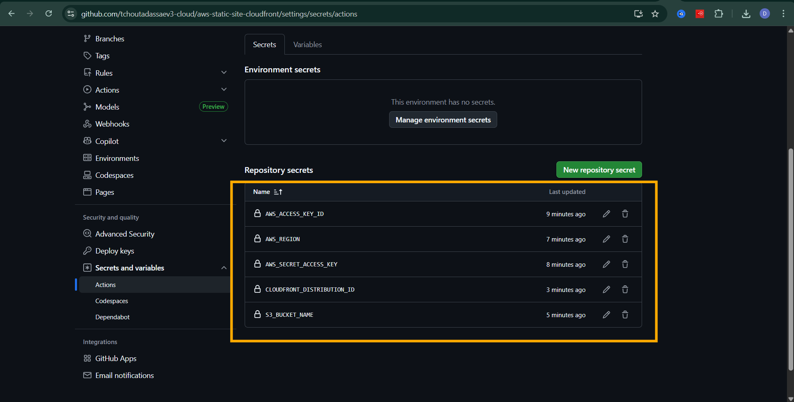

---

## 🌐 Step 6 — CloudFront Distribution ID

The distribution ID is required to trigger cache invalidation after deployment.

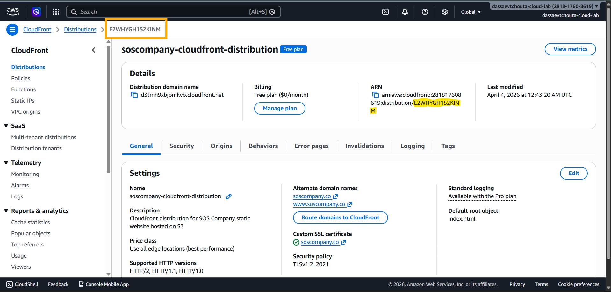

---

## ⚙️ Step 7 — GitHub Actions Workflow Setup

### Workflow File Creation

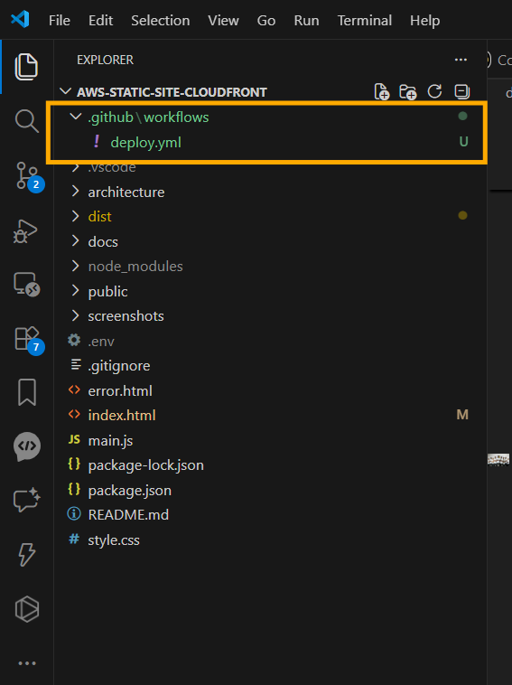

### Pipeline Configuration (`deploy.yml`)

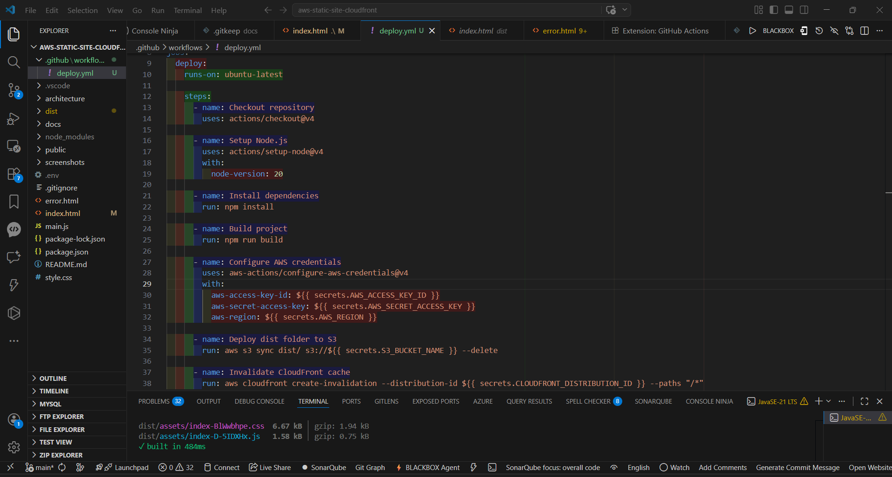

---

## 🚀 Step 8 — Pipeline Execution

### Workflow Triggered

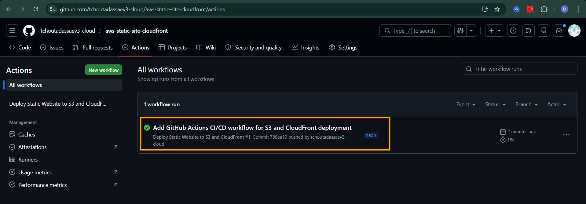

### Pipeline Running

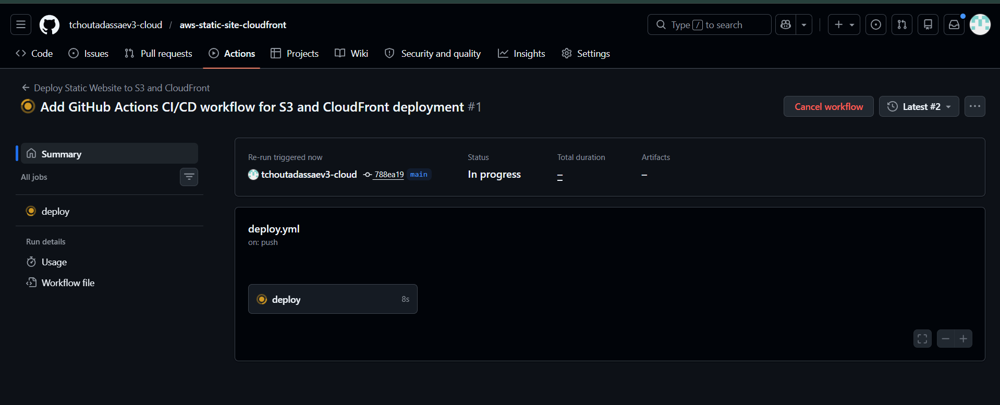
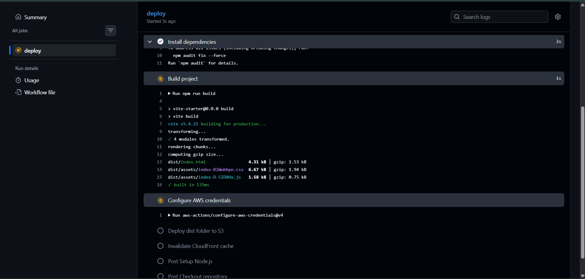

### Pipeline Success ✅

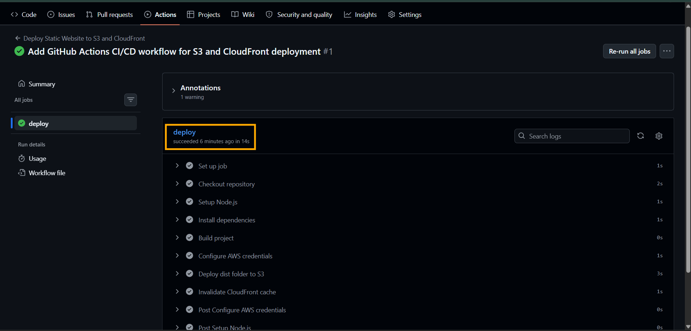

---

## 🌍 Step 9 — Live Website Updated

After the pipeline execution, the changes were instantly reflected on the live website.

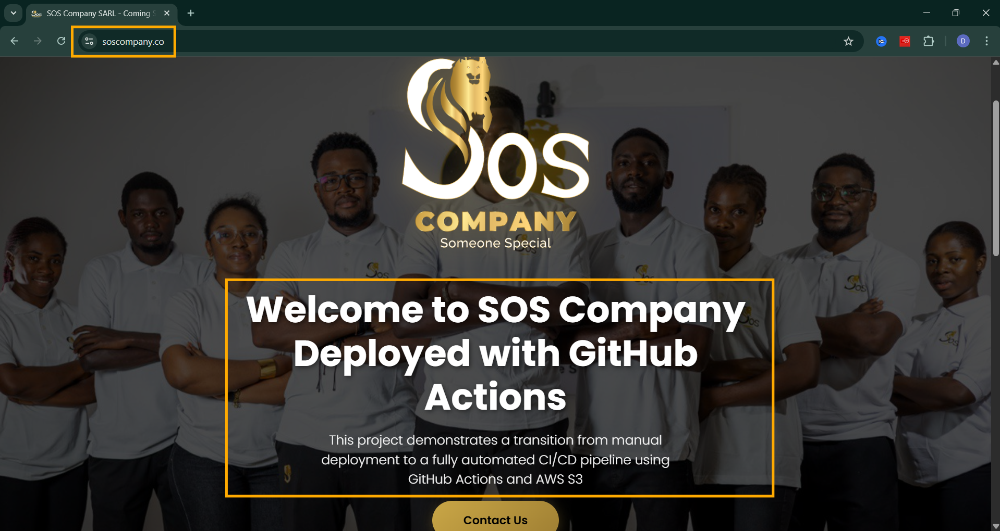

---

## ⚡ Step 10 — CloudFront Cache Invalidation

CloudFront cache was successfully invalidated to ensure that users always receive the latest version of the website.

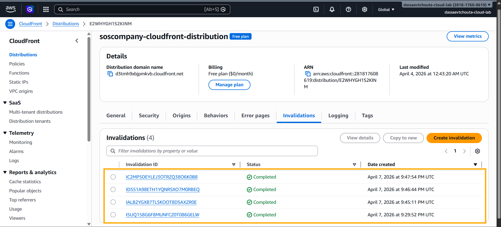

---

## 🎯 Final Result

The deployment process is now fully automated.

Instead of manually uploading files to S3, the system:

- builds automatically  
- deploys automatically  
- updates instantly  
- ensures consistency across deployments  

---

## 💡 Key Benefits

- 🚀 Faster and more reliable deployments  
- 🔒 Secure credential management with GitHub Secrets  
- 🔁 Fully automated workflow  
- 🌍 Production-ready deployment pipeline  
- ⚙️ Real-world DevOps practices  

---

## 🧠 What This Demonstrates

This project now showcases:

- AWS (S3, CloudFront, ACM)  
- CI/CD pipeline design  
- GitHub Actions automation  
- IAM security best practices  
- End-to-end deployment workflow  

---

# 📌 Final Conclusion

This project demonstrates a complete end-to-end approach to cloud deployment on AWS.

Starting from a manual setup to fully understand each component, and evolving into a fully automated CI/CD pipeline, it reflects a real-world DevOps workflow.

It highlights my ability to:

- design scalable cloud architectures  
- deploy production-ready applications  
- automate workflows using CI/CD practices  
- apply security and best practices in a real environment  

This project is part of a broader initiative to build and document real-world cloud solutions, showcasing both technical depth and practical implementation skills.

---

# 👨‍💻 Author

**Dassaev TCHOUTA**  
Cloud & DevOps Engineer  

- AWS | Cloud Architecture | CI/CD | Automation  
- Passionate about building scalable and production-ready systems  

📫 Open to opportunities and collaborations
