# 🚀 AWS Static Website Deployment (S3 + CloudFront + ACM + Custom Domain)

## 🌐 Live Demo

👉 https://soscompany.co  
👉 https://www.soscompany.co  

---

## 📖 Story Behind This Project

When I started learning AWS, deploying a real-world application felt complex and overwhelming.

Instead of just following tutorials, I decided to build a complete production-ready project from scratch something that reflects real industry practices.

This project demonstrates my ability to:

- Deploy a static website using AWS
- Configure a global CDN with CloudFront
- Secure the application using HTTPS (ACM)
- Connect and manage a real custom domain

During this project, I faced real-world challenges such as:

- ❌ S3 Access Denied errors
- ❌ DNS misconfiguration issues
- ❌ SSL validation delays

And I successfully diagnosed and resolved each of them.

👉 This is not just a tutorial project — it is a real deployment scenario.

---

## 🏗️ Architecture Overview

---

## 🎯 Project Overview

This project demonstrates the deployment of a **production-ready static website** using AWS services.

The goal was to build a **scalable, secure, and globally distributed web application** using:

- Amazon S3 (static hosting)
- Amazon CloudFront (CDN)
- AWS Certificate Manager (SSL/TLS)
- Custom domain via Namecheap

---

## ⚙️ Tech Stack

- **Frontend**: HTML, CSS, JavaScript (Vite build)
- **Cloud Provider**: AWS
- **Storage**: Amazon S3
- **CDN**: Amazon CloudFront
- **SSL**: AWS Certificate Manager (ACM)
- **DNS**: Namecheap

---

# 🧩 Step-by-Step Deployment

---

## 1️⃣ Local Development & Build

### Project structure

### Local preview
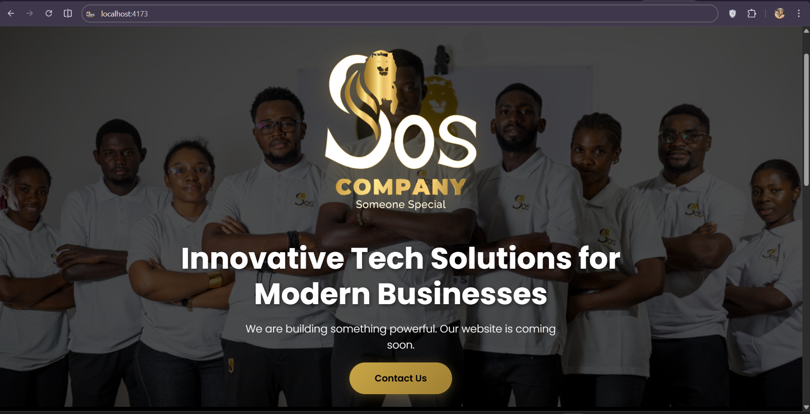

### Production build
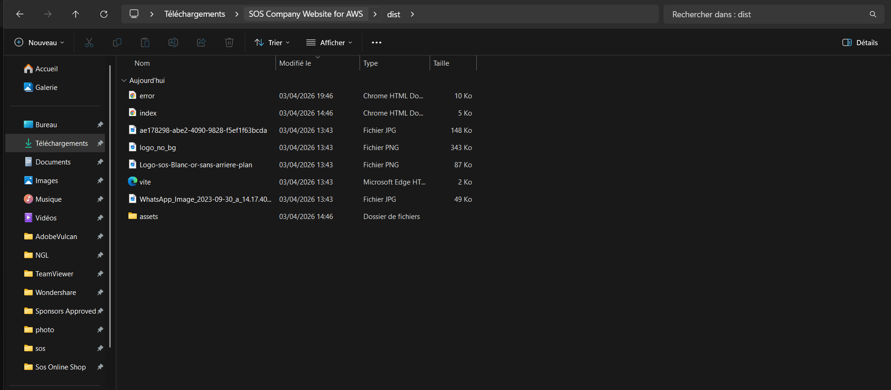

---

## 2️⃣ GitHub Repository Setup

### Repository created

### Project structure on GitHub

---

## 3️⃣ Amazon S3 Setup

### Bucket creation
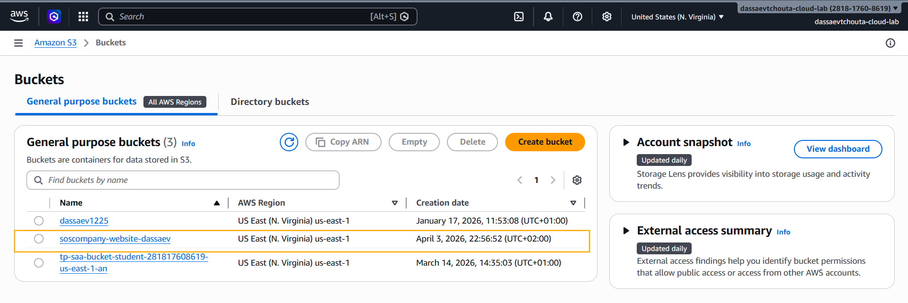

### Files uploaded
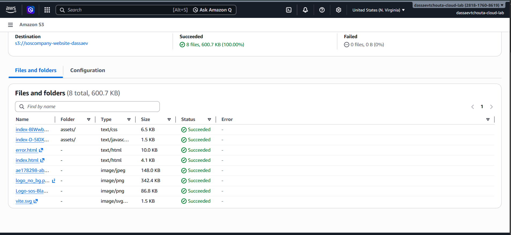

### Static hosting enabled
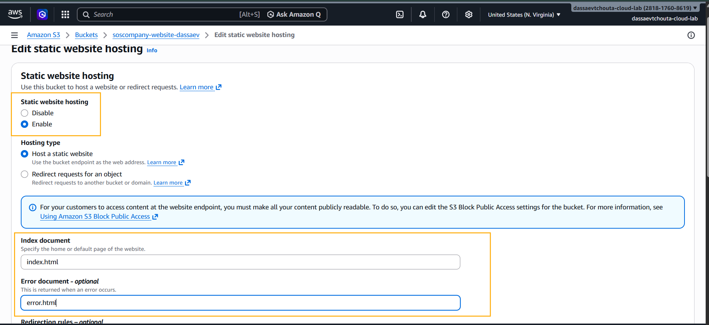

### First test (before permissions)
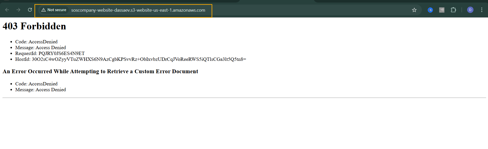

### Public bucket policy

### Website working (S3 endpoint)

---

## 4️⃣ CloudFront (CDN Setup)

### Get started
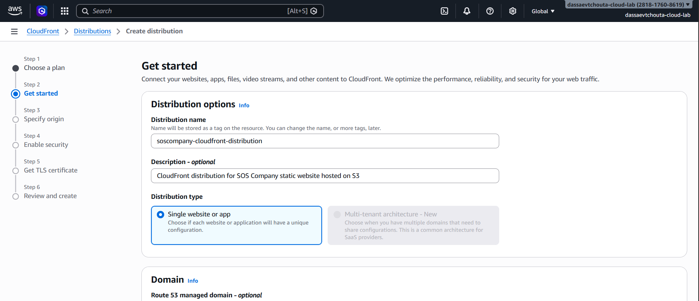

### Origin configuration

### Security settings
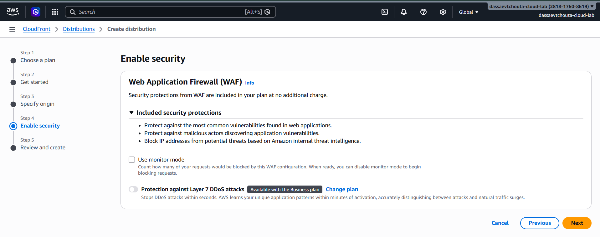

### Distribution deploying
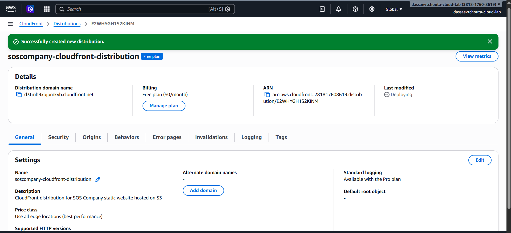

### CloudFront live

### Default root object fix

---

## 5️⃣ SSL Certificate (ACM)

### ACM Dashboard

### Domain configuration

### CNAME records (AWS)
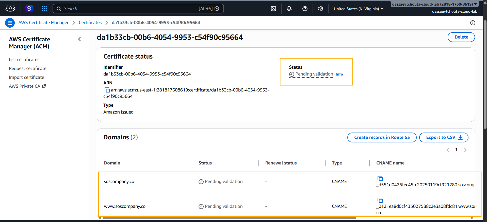

### DNS validation (Namecheap)
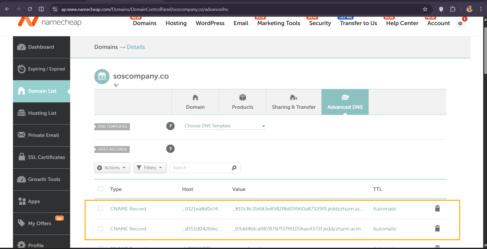

### Certificate issued

---

## 6️⃣ Custom Domain + HTTPS

### CloudFront domain configuration
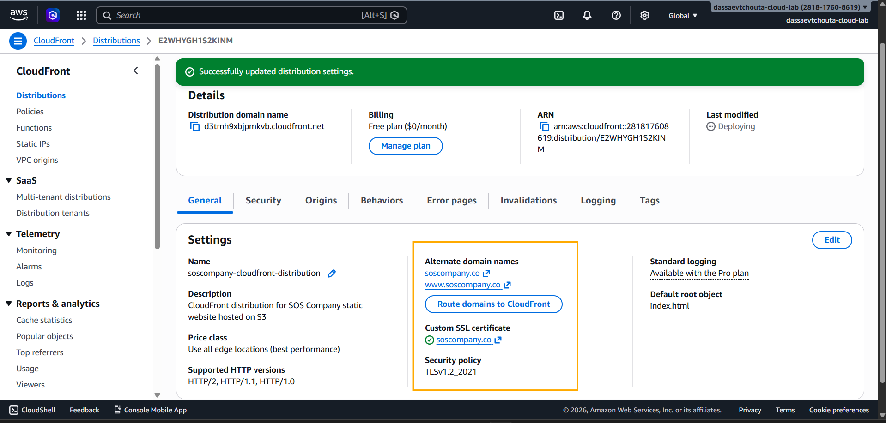

### DNS setup (Namecheap → CloudFront)

### Final result (HTTPS working)
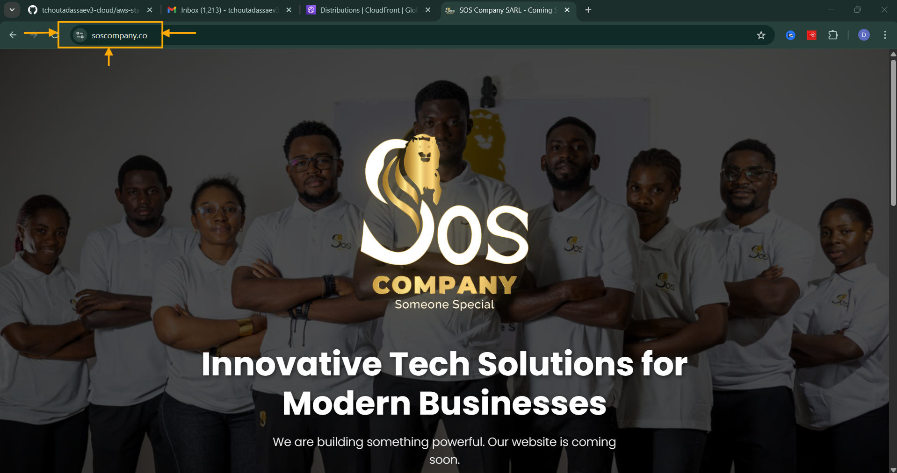

---

# 🔥 Key Features

- ✅ Static website hosting with S3  
- ✅ Global CDN with CloudFront  
- ✅ HTTPS secured with ACM  
- ✅ Custom domain integration  
- ✅ High performance & low latency  
- ✅ Production-ready deployment  

---

# 🧠 Challenges & Solutions

### ❌ S3 Access Denied (403)
✔️ Fixed by applying a public bucket policy

### ❌ CloudFront not loading index.html
✔️ Fixed by setting **Default Root Object**

### ❌ SSL validation stuck
✔️ Fixed DNS CNAME configuration in Namecheap

### ❌ Git push rejected
✔️ Solved using `git pull --rebase`

---

# 💼 Skills Demonstrated

- AWS S3 configuration
- CDN architecture (CloudFront)
- DNS management (Namecheap)
- SSL/TLS setup (ACM)
- Debugging production issues
- Git & GitHub workflow
- End-to-end cloud deployment

---

# 🚀 Future Improvements

- CI/CD pipeline (GitHub Actions)
- Infrastructure as Code (Terraform)
- Monitoring (CloudWatch)
- Logging & alerting
- Route 53 integration
- WAF security layer

---

# 📌 What I learned

This project demonstrates the ability to design and deploy a **secure, scalable, and production-ready web architecture on AWS**.

It highlights real-world problem-solving, cloud best practices, and DevOps fundamentals.

---

# 👨‍💻 Author

**Dassaev TCHOUTA**  
Cloud / DevOps Enthusiast 🚀
